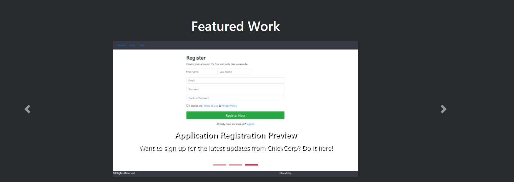
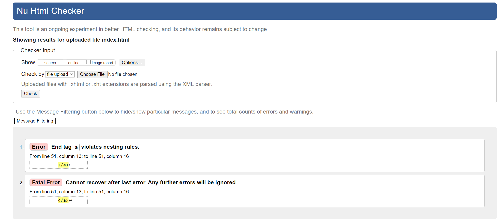
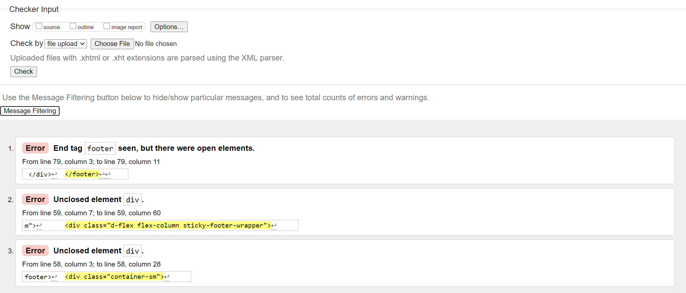

# Portfolio

# Index Page 
1. I began linking the style sheets for Boostrap + Bootswatch Theme + Custom Style Sheet.
2. I then made the nav bar and footer using Boostrap Components.
3. I then created the new pages (i.e. My Work and Contact) and linked to to the appropiate nav elements.
4. Continuing on the Index page, I created a carousel displaying my "featured work". I sized the images a bit smaller to allow the navigation arrows to be seen clearly.

5. I then proceeded to with the about me section with a single column and rows from bootstrap.

# My Work
1. After using the new page, I duplicated the head, nav, and footer from the index page to keep the content consistent. 
2. I used boostrap rows with two columns each to create my grid. 
3. I also made sure that all my grid components used the extra small width to create responsive content. 
4. I also added a:hover for added effect.

# Contact 
1. This page was the simplets as i added two columns with one featuring subrows.

# Validator

I then ran each page through the validator with litte to no errors (or any that broke the page). 

